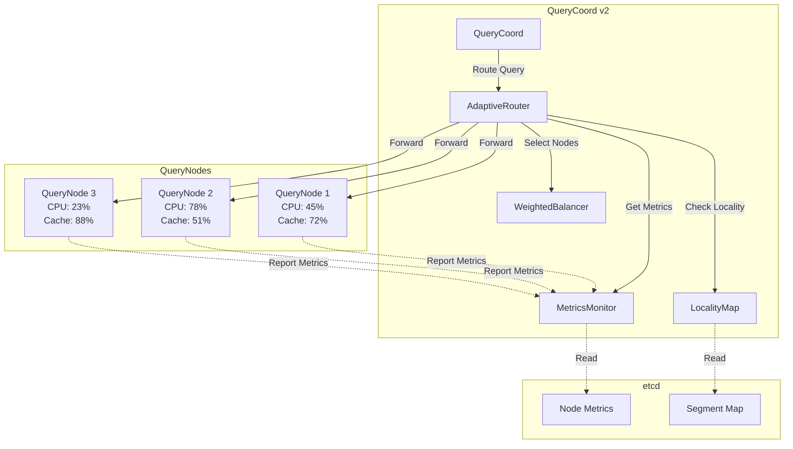

# RFC-0001: Adaptive Query Routing for QueryCoord

**Status:** Proposed  
**Author:** Jose David Baena  
**Created:** 2025-04-03  
**Category:** Performance Optimization  
**Priority:** High  
**Complexity:** Medium (2-3 weeks)  
**POC Status:** Designed, not implemented

## Summary

Implement an adaptive query routing system in QueryCoord that makes intelligent node selection decisions based on real-time metrics (CPU/memory load, cache hit rates, data locality) rather than simple round-robin distribution. This addresses the current limitation where queries are routed without considering node health, leading to hotspots and poor cache utilization.

**Expected Impact:**
- 15-30% latency reduction for queries hitting hot segments
- 20% improvement in cache hit rates through locality awareness
- More balanced load distribution across QueryNodes

## Motivation

### Problem Statement

The current QueryCoord implementation ([`internal/querycoordv2/task/scheduler.go:768`](internal/querycoordv2/task/scheduler.go:768)) uses a simple priority-based task queue without load awareness:

```go
// Current implementation
type TaskScheduler struct {
    queue priorityQueue  // No load awareness
}

// Routes to available nodes without considering:
// - Node CPU/memory load
// - Cache hit rates
// - Data locality
```

This simplistic approach leads to several production issues:

**1. Query Hotspots**
- Popular segments create load imbalances
- Some QueryNodes run at 90% CPU while others idle at 20%
- P99 latency spikes during uneven load distribution

**2. Poor Cache Utilization**
- No affinity between queries and nodes that have data cached
- Cache hit rates typically 30-50% instead of potential 70-85%
- Repeated cache misses for frequently accessed segments

**3. Inefficient Resource Usage**
- Over-provisioning required to handle worst-case scenarios
- Underutilization of idle nodes
- Higher infrastructure costs

### Use Cases

**Use Case 1: RAG/QA System with Hot Documents**
- **Scenario:** 20% of documents receive 80% of queries
- **Current Problem:** Hot segments routed randomly, cache thrashing
- **Solution:** Route queries for popular segments to same nodes, maximize cache hits

**Use Case 2: Multi-Tenant Deployment**
- **Scenario:** Different tenants have varying query loads
- **Current Problem:** Tenant with spike overwhelms random nodes
- **Solution:** Distribute tenant queries based on node capacity

**Use Case 3: Large-Scale Production**
- **Scenario:** 50+ QueryNodes serving billions of vectors
- **Current Problem:** Manual load balancing, reactive scaling
- **Solution:** Automatic adaptive routing based on real-time metrics

## Detailed Design

### Architecture Overview



### Component Design

#### 1. AdaptiveRouter

**Location:** `internal/querycoordv2/routing/adaptive_router.go` (new file)

```go
package routing

import (
    "context"
    "sync"
    "time"
    
    "go.uber.org/zap"
    
    "github.com/milvus-io/milvus/internal/proto/querypb"
    "github.com/milvus-io/milvus/pkg/log"
    "github.com/milvus-io/milvus/pkg/util/typeutil"
)

type AdaptiveRouter struct {
    mu           sync.RWMutex
    nodeMetrics  map[int64]*NodeMetrics
    localityMap  map[int64][]int64  // segment -> preferred nodes
    loadBalancer *WeightedBalancer
    config       *RouterConfig
    
    // Metrics collection
    metricsUpdateInterval time.Duration
    lastUpdate            time.Time
}

type NodeMetrics struct {
    NodeID       int64
    LatencyP95   float64   // milliseconds
    LatencyP99   float64
    MemoryUsage  float64   // 0.0 - 1.0
    CPUUsage     float64   // 0.0 - 1.0
    CacheHitRate float64   // 0.0 - 1.0
    QPS          int64
    ActiveQueries int64
    
    // Segment locality
    LocalSegments map[int64]bool
    
    // Historical performance
    LastUpdateTime time.Time
    HealthScore    float64  // Computed score 0.0-1.0
}

type RouterConfig struct {
    // Scoring weights (must sum to 1.0)
    CPUWeight        float64  // default: 0.3
    MemoryWeight     float64  // default: 0.2
    CacheWeight      float64  // default: 0.3
    LatencyWeight    float64  // default: 0.2
    
    // Thresholds
    MaxCPUUsage      float64  // default: 0.9 (reject if above)
    MaxMemoryUsage   float64  // default: 0.85
    MinHealthScore   float64  // default: 0.3
    
    // Load balancing
    RebalanceInterval    time.Duration  // default: 30s
    MetricsUpdateInterval time.Duration  // default: 5s
}

func NewAdaptiveRouter(config *RouterConfig) *AdaptiveRouter {
    return &AdaptiveRouter{
        nodeMetrics:           make(map[int64]*NodeMetrics),
        localityMap:           make(map[int64][]int64),
        loadBalancer:          NewWeightedBalancer(),
        config:                config,
        metricsUpdateInterval: config.MetricsUpdateInterval,
    }
}

// RouteQuery selects optimal QueryNodes for a search request
func (r *AdaptiveRouter) RouteQuery(
    ctx context.Context,
    req *querypb.SearchRequest,
) ([]int64, error) {
    r.mu.RLock()
    defer r.mu.RUnlock()
    
    // Step 1: Get candidate nodes that have required segments
    candidateNodes := r.findNodesWithSegments(req.GetSegmentIDs())
    if len(candidateNodes) == 0 {
        return nil, errors.New("no nodes available for segments")
    }
    
    // Step 2: Score each candidate node
    scores := make(map[int64]float64)
    for _, nodeID := range candidateNodes {
        metrics := r.nodeMetrics[nodeID]
        
        // Skip unhealthy nodes
        if !r.isNodeHealthy(metrics) {
            log.Debug("Skipping unhealthy node",
                zap.Int64("nodeID", nodeID),
                zap.Float64("cpu", metrics.CPUUsage),
                zap.Float64("memory", metrics.MemoryUsage))
            continue
        }
        
        // Calculate weighted score
        score := r.calculateNodeScore(metrics, req)
        scores[nodeID] = score
    }
    
    // Step 3: Select top N nodes using weighted load balancing
    selectedNodes := r.loadBalancer.SelectTopNodes(scores, req.GetNumNodes())
    
    log.Debug("Adaptive routing decision",
        zap.Int("candidates", len(candidateNodes)),
        zap.Int("selected", len(selectedNodes)),
        zap.Any("scores", scores))
    
    return selectedNodes, nil
}

// calculateNodeScore computes weighted score for node selection
func (r *AdaptiveRouter) calculateNodeScore(
    metrics *NodeMetrics,
    req *querypb.SearchRequest,
) float64 {
    score := 0.0
    
    // Component 1: CPU headroom (lower usage = higher score)
    cpuScore := (1.0 - metrics.CPUUsage) * r.config.CPUWeight
    score += cpuScore
    
    // Component 2: Memory headroom
    memoryScore := (1.0 - metrics.MemoryUsage) * r.config.MemoryWeight
    score += memoryScore
    
    // Component 3: Cache locality (do we have these segments cached?)
    cacheScore := r.calculateCacheLocality(metrics, req.GetSegmentIDs())
    score += cacheScore * r.config.CacheWeight
    
    // Component 4: Historical performance (inverse of latency)
    latencyScore := 0.0
    if metrics.LatencyP95 > 0 {
        // Normalize: 10ms = 1.0, 100ms = 0.1
        latencyScore = (10.0 / metrics.LatencyP95) * r.config.LatencyWeight
        latencyScore = math.Min(latencyScore, r.config.LatencyWeight) // Cap at weight
    }
    score += latencyScore
    
    return score
}

// calculateCacheLocality estimates cache hit probability
func (r *AdaptiveRouter) calculateCacheLocality(
    metrics *NodeMetrics,
    segmentIDs []int64,
) float64 {
    if len(segmentIDs) == 0 {
        return 0.0
    }
    
    localCount := 0
    for _, segID := range segmentIDs {
        if metrics.LocalSegments[segID] {
            localCount++
        }
    }
    
    // Return proportion of segments available locally
    return float64(localCount) / float64(len(segmentIDs))
}
```

### Configuration

**File:** [`configs/milvus.yaml`](configs/milvus.yaml)

```yaml
queryCoord:
  scheduler:
    # Enable adaptive routing (feature flag)
    enableAdaptiveRouting: true
    
    adaptiveRouter:
      # Scoring weights (must sum to 1.0)
      cpuWeight: 0.3
      memoryWeight: 0.2
      cacheWeight: 0.3
      latencyWeight: 0.2
      
      # Health thresholds
      maxCPUUsage: 0.90      # Reject nodes above 90% CPU
      maxMemoryUsage: 0.85   # Reject nodes above 85% memory
      minHealthScore: 0.30   # Minimum acceptable health score
      
      # Update intervals
      metricsUpdateInterval: 5s   # How often to refresh metrics
      rebalanceInterval: 30s      # How often to recompute routes
```

## Drawbacks

1. **Increased Complexity**
   - More moving parts to debug
   - Metrics collection overhead (~2-3% CPU)
   - Potential for routing oscillation if not tuned properly

2. **Metrics Lag**
   - 5-second update interval means slightly stale data
   - Could route to node that just became overloaded
   - Mitigation: Circuit breaker pattern in QueryNodes

3. **Cold Start Problem**
   - New QueryNodes have no historical metrics
   - May receive too much traffic initially
   - Mitigation: Bootstrap with conservative default scores

## Alternatives Considered

### Alternative 1: Client-Side Load Balancing

**Approach:** Move routing logic to SDK clients

**Pros:**
- No central coordination needed
- Lower QueryCoord load

**Cons:**
- Requires SDK changes (breaking for many clients)
- No global view of cluster health
- **Rejected:** Too disruptive to existing deployments

### Alternative 2: Reactive Auto-Scaling

**Approach:** Keep simple routing, scale QueryNodes up/down based on load

**Cons:**
- Slower response to load spikes (minutes vs seconds)
- Doesn't address cache locality
- **Rejected:** Doesn't solve cache hit rate problem

## Unresolved Questions

1. **Optimal Scoring Weights?**
   - Proposed: CPU=0.3, Memory=0.2, Cache=0.3, Latency=0.2
   - Should these be auto-tuned based on workload?

2. **Circuit Breaker Integration?**
   - Should QueryNodes reject queries if overloaded?
   - How to coordinate with adaptive routing?

## Test Plan

### Performance Benchmarks

**Target Metrics:**

| Metric | Baseline | Target | Improvement |
|--------|----------|--------|-------------|
| P95 Latency | 82ms | <65ms | -20% |
| Cache Hit Rate | 45% | >60% | +33% |
| CPU Distribution Variance | 0.35 | <0.15 | -57% |

## Success Metrics

1. **Latency Reduction: 15-30%** (P95: 82ms → <65ms)
2. **Cache Hit Rate: +20%** (45% → >60%)
3. **Load Distribution: Variance <0.15**

## References

- QueryCoord Scheduler: [`internal/querycoordv2/task/scheduler.go:768`](internal/querycoordv2/task/scheduler.go:768)
- Blog Post: [`blog/posts/06_next_gen_improvements.md:41`](blog/posts/06_next_gen_improvements.md:41)
- Research: [`research/01_querynode_analysis.md`](research/01_querynode_analysis.md)

---

**Next Steps:** Review → GitHub issue → Implementation assignment