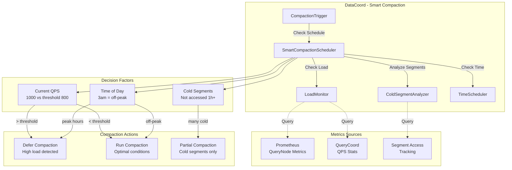

# RFC-0003: Smart Compaction Scheduling for DataCoord

**Status:** Proposed  
**Author:** Jose David Baena  
**Created:** 2025-04-03  
**Category:** Performance Optimization  
**Priority:** High  
**Complexity:** Medium-High (3-4 weeks)  
**POC Status:** Designed, awaiting implementation

## Summary

Replace time-based compaction triggers with intelligent load-aware scheduling that considers query traffic, time of day, and segment access patterns. Current implementation triggers compaction at fixed intervals regardless of system load, causing latency spikes during peak traffic. This proposal introduces smart scheduling that defers compaction to off-peak periods while prioritizing cold segments.

**Expected Impact:**
- 50% reduction in compaction-induced latency spikes
- More predictable query performance (no surprise P99 jumps)
- Better resource utilization (compact during idle periods)
- Configurable thresholds for different traffic patterns

## Motivation

### Problem Statement

The current DataCoord implementation ([`internal/datacoord/compaction_trigger_v2.go:222`](internal/datacoord/compaction_trigger_v2.go:222)) uses fixed time-based triggers:

```go
// Time-based triggers only
const (
    L0CompactionInterval        = 60    // seconds
    ClusteringCompactionInterval = 3600  // 1 hour
    MixCompactionInterval       = 300   // 5 minutes
)

// Triggers compaction at fixed intervals
// No consideration of:
// - Current query load
// - Time of day (peak vs off-peak)
// - Segment access patterns
```

**Real-World Impact:**

1. **Latency Spikes During Peak Hours**
   - Compaction triggers at 2pm (peak traffic)
   - P99 latency jumps from 50ms → 120ms
   - Duration: 5-10 minutes
   - Users notice degraded performance

2. **Wasted Off-Peak Resources**
   - System idle at 3am with 10% CPU
   - Could run aggressive compaction
   - Instead waits for scheduled interval during peak

3. **Inefficient Compaction**
   - Hot segments compacted unnecessarily
   - Cold segments (not accessed in hours) delayed
   - Sub-optimal resource allocation

### Use Cases

**Use Case 1: E-Commerce Search**
- **Traffic Pattern:** 9am-9pm peak, 9pm-9am idle
- **Current Problem:** Compaction runs during shopping hours
- **Solution:** Schedule compaction for 2am-6am window
- **Impact:** Zero user-visible latency spikes

**Use Case 2: 24/7 Service with Variable Load**
- **Traffic Pattern:** 1000 QPS peak, 100 QPS off-peak
- **Current Problem:** Fixed schedule ignores load variations
- **Solution:** Defer when QPS > 800, run when QPS < 200
- **Impact:** Compaction never impacts users

**Use Case 3: Read-Heavy Workload**
- **Scenario:** 80% of queries hit 20% of segments (hot data)
- **Current Problem:** Compacts hot and cold segments equally
- **Solution:** Prioritize cold segment compaction during peak, defer hot segments
- **Impact:** Minimal impact on cache performance

## Detailed Design

### Architecture Overview



### Component Design

#### 1. SmartCompactionScheduler

**Location:** `internal/datacoord/smart_compaction_scheduler.go` (new file)

```go
package datacoord

import (
    "context"
    "time"
    
    "go.uber.org/zap"
    
    "github.com/milvus-io/milvus/pkg/log"
)

type SmartCompactionScheduler struct {
    queryLoadMonitor  *QueryLoadMonitor
    segmentAnalyzer   *ColdSegmentAnalyzer
    scheduler         *TimeScheduler
    config            *CompactionConfig
    
    // State
    lastCompaction    time.Time
    deferredCount     int
}

type CompactionConfig struct {
    // Load-based thresholds
    PeakQPSThreshold     int64         // Don't compact above this QPS
    MinQPSForCompaction  int64         // Safe to compact below this
    
    // Time-based scheduling
    OffPeakHours         []int         // Preferred hours (e.g., [0,1,2,3,4,5])
    PeakHours            []int         // Avoid these hours
    
    // Segment analysis
    MinColdSegmentCount  int           // Minimum segments to trigger
    ColdSegmentThreshold time.Duration // Not accessed in X hours
    
    // Deferral limits
    MaxDeferralTime      time.Duration // Force compact after X hours
    MaxDeferralCount     int           // Force compact after N deferrals
    
    // Feature flags
    EnableSmartScheduling bool
    EnableColdSegmentPriority bool
}

func NewSmartCompactionScheduler(config *CompactionConfig) *SmartCompactionScheduler {
    return &SmartCompactionScheduler{
        queryLoadMonitor: NewQueryLoadMonitor(),
        segmentAnalyzer:  NewColdSegmentAnalyzer(),
        config:           config,
    }
}

// ShouldCompact determines if compaction should run now
func (s *SmartCompactionScheduler) ShouldCompact(
    ctx context.Context,
    compactionType string,
) CompactionDecision {
    if !s.config.EnableSmartScheduling {
        // Fallback to time-based
        return CompactionDecision{
            ShouldRun: true,
            Reason:    "smart scheduling disabled",
        }
    }
    
    // Check 1: Has compaction been deferred too long?
    if s.mustCompactNow() {
        return CompactionDecision{
            ShouldRun: true,
            Reason:    "max deferral reached",
            Priority:  "high",
        }
    }
    
    // Check 2: Query load
    currentQPS := s.queryLoadMonitor.CurrentQPS()
    if currentQPS > s.config.PeakQPSThreshold {
        s.deferCompaction("high query load")
        return CompactionDecision{
            ShouldRun: false,
            Reason:    fmt.Sprintf("QPS %d > threshold %d", 
                currentQPS, s.config.PeakQPSThreshold),
            DeferUntil: time.Now().Add(5 * time.Minute),
        }
    }
    
    // Check 3: Time of day
    currentHour := time.Now().Hour()
    if s.isPeakHour(currentHour) {
        s.deferCompaction("peak hours")
        return CompactionDecision{
            ShouldRun: false,
            Reason:    fmt.Sprintf("peak hour %d", currentHour),
            DeferUntil: s.nextOffPeakTime(),
        }
    }
    
    // Check 4: Cold segment analysis
    coldSegments := s.segmentAnalyzer.IdentifyColdSegments()
    if len(coldSegments) < s.config.MinColdSegmentCount {
        // Not enough cold segments, can defer
        return CompactionDecision{
            ShouldRun: false,
            Reason:    fmt.Sprintf("only %d cold segments (need %d)",
                len(coldSegments), s.config.MinColdSegmentCount),
            DeferUntil: time.Now().Add(10 * time.Minute),
        }
    }
    
    // All conditions met - run compaction
    log.Info("Smart compaction triggered",
        zap.String("type", compactionType),
        zap.Int64("qps", currentQPS),
        zap.Int("hour", currentHour),
        zap.Int("coldSegments", len(coldSegments)))
    
    s.lastCompaction = time.Now()
    s.deferredCount = 0
    
    return CompactionDecision{
        ShouldRun:      true,
        Reason:         "optimal conditions",
        Priority:       "normal",
        TargetSegments: coldSegments,  // Prioritize cold segments
    }
}

// mustCompactNow checks if we've deferred too long
func (s *SmartCompactionScheduler) mustCompactNow() bool {
    // Check 1: Time-based limit
    if time.Since(s.lastCompaction) > s.config.MaxDeferralTime {
        log.Warn("Force compaction: max deferral time exceeded",
            zap.Duration("since", time.Since(s.lastCompaction)),
            zap.Duration("limit", s.config.MaxDeferralTime))
        return true
    }
    
    // Check 2: Count-based limit
    if s.deferredCount >= s.config.MaxDeferralCount {
        log.Warn("Force compaction: max deferral count exceeded",
            zap.Int("count", s.deferredCount),
            zap.Int("limit", s.config.MaxDeferralCount))
        return true
    }
    
    return false
}

// deferCompaction increments deferral tracking
func (s *SmartCompactionScheduler) deferCompaction(reason string) {
    s.deferredCount++
    log.Debug("Compaction deferred",
        zap.String("reason", reason),
        zap.Int("deferralCount", s.deferredCount))
}

// isPeakHour checks if current hour is in peak hours
func (s *SmartCompactionScheduler) isPeakHour(hour int) bool {
    for _, peakHour := range s.config.PeakHours {
        if hour == peakHour {
            return true
        }
    }
    return false
}

// nextOffPeakTime calculates next off-peak window
func (s *SmartCompactionScheduler) nextOffPeakTime() time.Time {
    now := time.Now()
    
    for i := 1; i <= 24; i++ {
        nextHour := now.Add(time.Duration(i) * time.Hour)
        if !s.isPeakHour(nextHour.Hour()) {
            return nextHour
        }
    }
    
    // Fallback: 24 hours from now
    return now.Add(24 * time.Hour)
}

type CompactionDecision struct {
    ShouldRun      bool
    Reason         string
    Priority       string        // "high", "normal", "low"
    DeferUntil     time.Time
    TargetSegments []int64       // Specific segments to compact
}
```

#### 2. QueryLoadMonitor

**Location:** `internal/datacoord/query_load_monitor.go` (new file)

```go
package datacoord

import (
    "sync"
    "time"
    
    "github.com/milvus-io/milvus/pkg/metrics"
)

type QueryLoadMonitor struct {
    mu sync.RWMutex
    
    // Rolling window of QPS measurements
    qpsWindow    []int64
    windowSize   int
    currentIndex int
    
    // Update interval
    updateTicker *time.Ticker
}

func NewQueryLoadMonitor() *QueryLoadMonitor {
    monitor := &QueryLoadMonitor{
        qpsWindow:  make([]int64, 60), // 60-second window
        windowSize: 60,
    }
    
    // Start background updater
    monitor.updateTicker = time.NewTicker(1 * time.Second)
    go monitor.updateLoop()
    
    return monitor
}

// CurrentQPS returns average QPS over last minute
func (m *QueryLoadMonitor) CurrentQPS() int64 {
    m.mu.RLock()
    defer m.mu.RUnlock()
    
    sum := int64(0)
    count := 0
    
    for _, qps := range m.qpsWindow {
        if qps > 0 {
            sum += qps
            count++
        }
    }
    
    if count == 0 {
        return 0
    }
    
    return sum / int64(count)
}

// updateLoop periodically fetches QPS from Prometheus
func (m *QueryLoadMonitor) updateLoop() {
    for range m.updateTicker.C {
        qps := m.fetchCurrentQPS()
        
        m.mu.Lock()
        m.qpsWindow[m.currentIndex] = qps
        m.currentIndex = (m.currentIndex + 1) % m.windowSize
        m.mu.Unlock()
    }
}

// fetchCurrentQPS queries Prometheus for current QPS
func (m *QueryLoadMonitor) fetchCurrentQPS() int64 {
    // Get QPS from metrics
    // This is a placeholder - actual implementation would query Prometheus
    // or read from internal metrics
    
    // Example: sum of all QueryNode QPS
    totalQPS := metrics.QueryNodeSearchQPS.GetTotal()
    
    return totalQPS
}
```

#### 3. ColdSegmentAnalyzer

**Location:** `internal/datacoord/cold_segment_analyzer.go` (new file)

```go
package datacoord

import (
    "sync"
    "time"
)

type ColdSegmentAnalyzer struct {
    mu sync.RWMutex
    
    // Track last access time per segment
    segmentAccessTimes map[int64]time.Time
    
    coldThreshold time.Duration
}

func NewColdSegmentAnalyzer() *ColdSegmentAnalyzer {
    return &ColdSegmentAnalyzer{
        segmentAccessTimes: make(map[int64]time.Time),
        coldThreshold:      1 * time.Hour,
    }
}

// RecordAccess updates last access time for segment
func (a *ColdSegmentAnalyzer) RecordAccess(segmentID int64) {
    a.mu.Lock()
    defer a.mu.Unlock()
    
    a.segmentAccessTimes[segmentID] = time.Now()
}

// IdentifyColdSegments returns segments not accessed recently
func (a *ColdSegmentAnalyzer) IdentifyColdSegments() []int64 {
    a.mu.RLock()
    defer a.mu.RUnlock()
    
    threshold := time.Now().Add(-a.coldThreshold)
    cold := []int64{}
    
    for segmentID, lastAccess := range a.segmentAccessTimes {
        if lastAccess.Before(threshold) {
            cold = append(cold, segmentID)
        }
    }
    
    return cold
}

// SetColdThreshold configures what "cold" means
func (a *ColdSegmentAnalyzer) SetColdThreshold(duration time.Duration) {
    a.mu.Lock()
    defer a.mu.Unlock()
    
    a.coldThreshold = duration
}
```

### Configuration

**File:** [`configs/milvus.yaml`](configs/milvus.yaml)

```yaml
dataCoord:
  compaction:
    # Smart scheduling
    smartScheduling:
      enabled: true
      
      # QPS thresholds
      peakQPSThreshold: 1000      # Don't compact above this
      minQPSForCompaction: 200    # Safe to compact below this
      
      # Time-based scheduling
      offPeakHours: [0, 1, 2, 3, 4, 5, 6]  # Midnight to 6 AM
      peakHours: [9, 10, 11, 12, 13, 14, 15, 16, 17]  # 9am-5pm
      
      # Cold segment detection
      coldSegmentHours: 1         # Not accessed in 1 hour
      minColdSegments: 5          # Need at least 5 cold segments
      
      # Deferral limits (safety)
      maxDeferralHours: 12        # Force compact after 12 hours
      maxDeferralCount: 20        # Force compact after 20 deferrals
    
    # Existing time-based triggers (fallback)
    l0:
      triggerInterval: 60
    clustering:
      triggerInterval: 3600
    mix:
      triggerInterval: 300
```

## Drawbacks

1. **Configuration Complexity**
   - More parameters to tune
   - Requires understanding of traffic patterns
   - Mitigation: Good defaults, auto-tuning in future

2. **Potential for Excessive Deferral**
   - If always busy, compaction never runs
   - Data quality degrades
   - Mitigation: Max deferral limits (12 hours, 20 attempts)

3. **Cold Segment Tracking Overhead**
   - Need to track access times
   - Additional memory usage
   - Mitigation: Lightweight tracking, periodic cleanup

## Alternatives Considered

### Alternative 1: Adaptive Interval Adjustment

**Approach:** Dynamically adjust compaction intervals based on load

**Cons:**
- Still timer-based, not load-aware
- Can't target off-peak hours
- **Rejected:** Doesn't solve core problem

### Alternative 2: Manual Scheduling

**Approach:** Let operators trigger compaction manually

**Cons:**
- Requires 24/7 human oversight
- Not scalable
- **Rejected:** Not practical for production

## Test Plan

### Target Metrics

| Metric | Baseline | Target | Improvement |
|--------|----------|--------|-------------|
| P99 Latency Spikes | 120ms | <60ms | -50% |
| Compaction During Peak | 40% | <10% | -75% |
| Off-Peak Utilization | 20% | >60% | +200% |

## Success Metrics

1. **50% reduction in latency spikes** (120ms → <60ms P99)
2. **<10% compaction during peak hours** (9am-5pm)
3. **>60% off-peak resource usage** (midnight-6am)

## References

- Implementation: [`internal/datacoord/compaction_trigger_v2.go:222`](internal/datacoord/compaction_trigger_v2.go:222)
- Blog Post: [`blog/posts/06_next_gen_improvements.md:461`](blog/posts/06_next_gen_improvements.md:461)
- Research: [`research/02_datacoord_analysis.md`](research/02_datacoord_analysis.md)

---

**Next Steps:** Design review → Configuration tuning → Gradual rollout