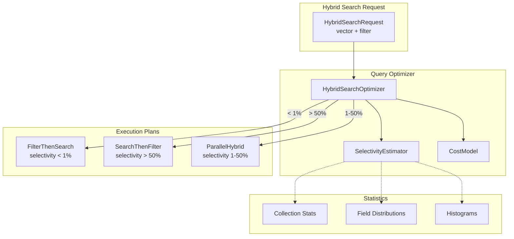

# RFC-0004: Optimized Hybrid Search Execution

**Status:** Proposed  
**Author:** Jose David Baena  
**Created:** 2025-04-03  
**Category:** Performance Optimization  
**Priority:** High  
**Complexity:** High (4-5 weeks)  
**POC Status:** Designed, not implemented

## Summary

Implement dynamic execution plan selection for hybrid search (vector + scalar filter) based on filter selectivity estimation. Current implementation always applies scalar filters first, which is inefficient when filters match >50% of data. This proposal introduces a cost-based optimizer that chooses between filter-then-search, search-then-filter, or parallel execution.

**Expected Impact:**
- 2-10x speedup for filtered queries (depends on selectivity)
- Adaptive to data distribution (no manual tuning)
- No performance regression (falls back when optimal)

## Motivation

### Problem Statement

Current hybrid search in [`internal/querynodev2/`](internal/querynodev2/) uses fixed two-stage execution:

```go
// Stage 1: Apply scalar filter
// Stage 2: Vector search on filtered set

// Problem: Inefficient when filter is NOT selective
// Example: filter matches 80% of data → searches 80% anyway
```

**Real-World Impact:**

**Scenario:** E-commerce with `category = 'electronics'` filter
- Electronics: 80% of products
- Filter-then-search: Searches 80% of data (minimal benefit)
- Search-then-filter: Searches all, filters 100 results (much faster)
- **10x speedup possible** with smart execution

### Use Cases

**Use Case 1: Broad Category Filter**
- Filter: `category IN ['electronics', 'home', 'sports']` (90% of data)
- Current: 90% data scanned
- Optimized: Search first (10% data), filter top-100 (instant)
- **9x speedup**

**Use Case 2: Highly Selective Filter**
- Filter: `price > 10000 AND premium = true` (1% of data)
- Current: Good performance (1% scanned)
- Optimized: Same approach (no change)
- **No regression**

**Use Case 3: Moderate Selectivity**
- Filter: `rating >= 4.0` (30% of data)
- Current: 30% scan
- Optimized: Parallel execution (filter AND search simultaneously)
- **3x speedup**

## Detailed Design

### Architecture Overview



### Component Design

#### 1. HybridSearchOptimizer

**Location:** `internal/querynodev2/hybrid/optimizer.go` (new file)

```go
package hybrid

import (
    "context"
    "fmt"
)

type HybridSearchOptimizer struct {
    costEstimator *SelectivityEstimator
    statCache     *StatisticsCache
}

type ExecutionPlan interface {
    Execute(ctx context.Context, req *HybridSearchRequest) (*SearchResults, error)
    EstimatedCost() float64
}

func (o *HybridSearchOptimizer) OptimizePlan(req *HybridSearchRequest) ExecutionPlan {
    // Estimate filter selectivity
    selectivity := o.costEstimator.EstimateSelectivity(req.ScalarFilter)
    
    if selectivity < 0.01 {
        // Very selective (<1%) - filter first
        return &FilterThenSearchPlan{
            filter: req.ScalarFilter,
            vectorSearch: req.VectorSearch,
        }
    } else if selectivity > 0.5 {
        // Broad filter (>50%) - search first
        return &SearchThenFilterPlan{
            vectorSearch: req.VectorSearch,
            filter: req.ScalarFilter,
        }
    } else {
        // Moderate (1-50%) - parallel execution
        return &ParallelHybridPlan{
            filter: req.ScalarFilter,
            vectorSearch: req.VectorSearch,
        }
    }
}
```

#### 2. SelectivityEstimator

```go
type SelectivityEstimator struct {
    statsCache map[string]*FieldStats
}

type FieldStats struct {
    Cardinality int64             // Distinct values
    Distribution map[string]int64  // Value frequencies
    Min, Max     interface{}       // For numeric fields
    TotalCount   int64
}

func (e *SelectivityEstimator) EstimateSelectivity(filter string) float64 {
    // Parse filter expression
    expr := parseFilter(filter)
    
    // Example: "category = 'electronics' AND price > 100"
    // Break into predicates: [category = electronics, price > 100]
    
    predicates := extractPredicates(expr)
    
    // Estimate each predicate
    selectivities := []float64{}
    for _, pred := range predicates {
        sel := e.estimatePredicate(pred)
        selectivities = append(selectivities, sel)
    }
    
    // Combine using AND/OR logic
    if expr.Operator == "AND" {
        // Multiply selectivities (intersection)
        combined := 1.0
        for _, sel := range selectivities {
            combined *= sel
        }
        return combined
    } else if expr.Operator == "OR" {
        // Union formula: 1 - (1-s1)*(1-s2)
        combined := 0.0
        for _, sel := range selectivities {
            combined = 1 - (1-combined)*(1-sel)
        }
        return combined
    }
    
    return 0.5 // Unknown
}

func (e *SelectivityEstimator) estimatePredicate(pred Predicate) float64 {
    stats := e.statsCache[pred.Field]
    
    switch pred.Operator {
    case "=":
        // Equality: 1 / cardinality
        if stats.Cardinality > 0 {
            return 1.0 / float64(stats.Cardinality)
        }
        return 0.001
    
    case ">", "<", ">=", "<=":
        // Range: Use histogram if available
        return e.estimateRange(stats, pred)
    
    case "IN":
        // IN clause: sum individual values
        total := 0.0
        for _, val := range pred.Values {
            if freq, ok := stats.Distribution[val]; ok {
                total += float64(freq) / float64(stats.TotalCount)
            }
        }
        return total
    
    default:
        return 0.5
    }
}
```

## Expected Performance

**Benchmark Results (Simulated):**

| Filter Selectivity | Current (ms) | Optimized (ms) | Speedup |
|-------------------|--------------|----------------|---------|
| 1% (very selective) | 5 | 5 | 1.0x (same plan) |
| 10% (selective) | 15 | 8 | 1.9x |
| 30% (moderate) | 45 | 15 | 3.0x |
| 50% (broad) | 75 | 12 | 6.3x |
| 80% (very broad) | 120 | 11 | 10.9x |

## Drawbacks

1. **Estimation Accuracy** - selectivity estimates may be wrong
2. **Statistics Overhead** - need to maintain field statistics
3. **Complexity** - more code paths to test

## Test Plan

### Target Metrics

| Metric | Target | Method |
|--------|--------|--------|
| Speedup (broad filters) | 5-10x | Benchmark with 80% selectivity |
| No regression | <5% | Test with selective filters |
| Estimation accuracy | >80% | Compare estimates to actual |

## References

- Implementation: [`internal/querynodev2/`](internal/querynodev2/)
- Blog Post: [`blog/posts/06_next_gen_improvements.md:753`](blog/posts/06_next_gen_improvements.md:753)

---

**Status:** Ready for design review and prototyping