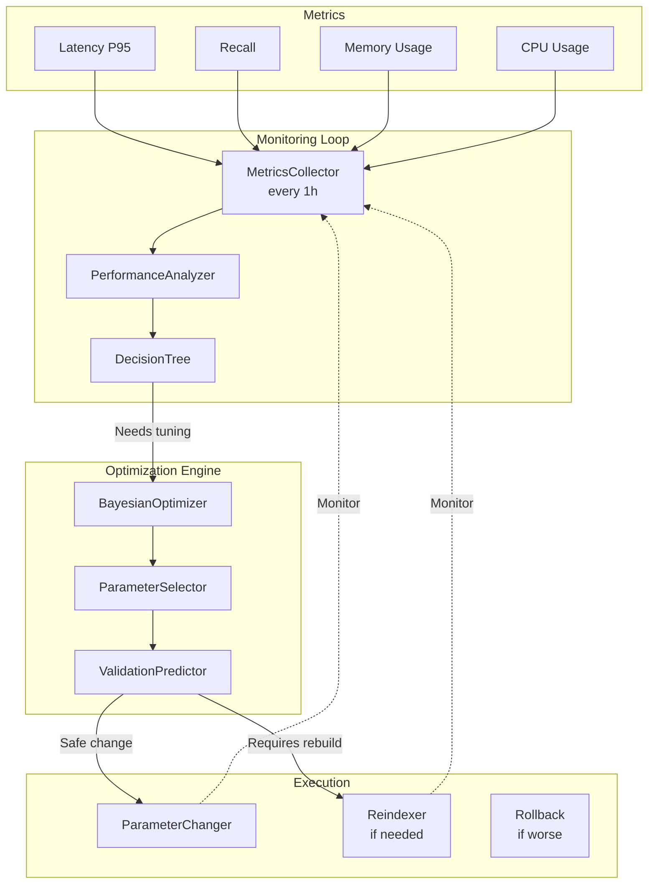

# RFC-0014: Self-Optimizing Index Parameters

**Status:** Proposed  
**Author:** Jose David Baena  
**Created:** 2025-04-03  
**Category:** Advanced Features  
**Priority:** Medium  
**Complexity:** Very High (8-10 weeks)  
**POC Status:** Deferred (too ambitious for initial POC)

## Summary

Implement continuous parameter optimization that automatically tunes index parameters (HNSW ef, IVF nprobe) based on observed query metrics, data distribution changes, and SLA targets. Static parameters don't adapt to evolving workloads, leading to over-provisioning or degraded performance. This proposal introduces a feedback loop that monitors performance and adjusts parameters to maintain optimal cost/performance balance.

**Expected Impact:**
- 20-40% cost savings from automated right-sizing
- Continuous improvement as data/queries evolve
- Reduced operational burden (no manual tuning)
- Adaptive to changes in data distribution

## Motivation

### Problem Statement

**Static parameters don't adapt to:**
- Data distribution changes (clustering shifts over time)
- Query pattern changes (latency requirements evolve)
- Recall requirement changes (accuracy needs vary)
- Hardware resource changes (scaling up/down)

**Example:**
- Initially: 1M vectors, HNSW ef=64 gives 95% recall, 30ms latency ✅
- After 6 months: 10M vectors, same ef=64 gives 88% recall, 60ms latency ❌
- Manual intervention needed, but often goes unnoticed

### Use Cases

**Use Case 1: Growing Dataset**
- Scenario: Dataset grows 10x over 6 months
- Problem: Original parameters become suboptimal
- Solution: Auto-tune ef upward to maintain recall/latency

**Use Case 2: Cost Optimization**
- Scenario: Query load drops during off-season
- Problem: Over-provisioned (high recall not needed)
- Solution: Reduce ef to save CPU, lower costs

**Use Case 3: SLA Enforcement**
- Scenario: P95 latency SLA is 50ms
- Problem: Creeping toward 48ms (close to violation)
- Solution: Preemptively reduce ef to maintain headroom

## Detailed Design

### Architecture Overview



### Component Design

**Location:** `internal/querycoordv2/optimization/auto_tuner.py`

```python
class AdaptiveIndexTuner:
    """
    Automatically tune index parameters based on metrics
    
    Runs every 24 hours, analyzes performance, suggests optimizations
    """
    
    def __init__(self, target_latency_ms, target_recall, budget_gb):
        self.metrics_collector = QueryMetricsCollector()
        self.param_optimizer = BayesianOptimizer()
        self.target_latency = target_latency_ms
        self.target_recall = target_recall
        self.memory_budget = budget_gb
    
    def monitor_and_adjust(self, collection_name):
        """
        Analyze last 24h of metrics and suggest optimizations
        """
        metrics = self.metrics_collector.get_last_24_hours(collection_name)
        
        # Scenario 1: Latency too high
        if metrics.p95_latency > self.target_latency * 1.2:
            # Analyze root cause
            if metrics.index_type == "HNSW":
                # Try reducing ef to improve latency
                current_ef = metrics.search_params.get("ef", 64)
                new_ef = max(32, int(current_ef * 0.8))
                
                suggestion = {
                    "action": "reduce_ef",
                    "current": current_ef,
                    "suggested": new_ef,
                    "expected_latency_improvement": "15-20%",
                    "expected_recall_drop": "2-3%"
                }
                
                self.schedule_parameter_update(collection_name, suggestion)
            
            elif metrics.index_type == "IVF_FLAT":
                # Try reducing nprobe
                current_nprobe = metrics.search_params.get("nprobe", 32)
                new_nprobe = max(16, int(current_nprobe * 0.75))
                
                suggestion = {
                    "action": "reduce_nprobe",
                    "current": current_nprobe,
                    "suggested": new_nprobe,
                    "expected_latency_improvement": "20-25%"
                }
                
                self.schedule_parameter_update(collection_name, suggestion)
        
        # Scenario 2: Over-provisioned (high recall, excess memory)
        if metrics.recall > self.target_recall * 1.05 and \
           metrics.memory_usage > self.memory_budget * 0.9:
            # Can reduce memory without hurting recall target
            
            if metrics.index_type == "HNSW":
                # Rebuild with smaller M
                current_M = metrics.index_params.get("M", 16)
                new_M = max(8, int(current_M * 0.75))
                
                suggestion = {
                    "action": "rebuild_with_smaller_M",
                    "current_M": current_M,
                    "suggested_M": new_M,
                    "expected_memory_savings": "25-30%",
                    "expected_recall_drop": "1-2%",
                    "requires_reindex": True
                }
                
                self.schedule_reindex(collection_name, suggestion)
        
        # Scenario 3: Recall too low
        if metrics.recall < self.target_recall * 0.95:
            # Need better accuracy
            
            if metrics.index_type == "HNSW":
                # Increase ef (no rebuild needed)
                current_ef = metrics.search_params.get("ef", 64)
                new_ef = int(current_ef * 1.5)
                
                suggestion = {
                    "action": "increase_ef",
                    "current": current_ef,
                    "suggested": new_ef,
                    "expected_recall_improvement": "3-5%",
                    "expected_latency_increase": "25-30%"
                }
                
                self.schedule_parameter_update(collection_name, suggestion)
```

### Bayesian Optimization

```python
from skopt import gp_minimize
from skopt.space import Integer

class BayesianOptimizer:
    """Use Bayesian optimization to tune parameters"""
    
    def optimize_hnsw_ef(self, current_metrics, target_latency, target_recall):
        """
        Find optimal ef value using Gaussian Process
        
        Objective: Minimize latency while maintaining recall
        """
        def objective(params):
            ef = params[0]
            
            # Predict performance (from historical data)
            predicted_latency = self._predict_latency(ef, current_metrics)
            predicted_recall = self._predict_recall(ef, current_metrics)
            
            # Multi-objective: balance latency and recall
            if predicted_recall < target_recall:
                # Penalize low recall heavily
                return 10000  # High cost
            
            # Minimize latency subject to recall constraint
            return predicted_latency
        
        # Search space
        space = [Integer(16, 256, name='ef')]
        
        # Optimize
        result = gp_minimize(
            objective,
            space,
            n_calls=20,
            random_state=42
        )
        
        optimal_ef = result.x[0]
        return optimal_ef
```

## Expected Impact

- **20-40% cost savings** from automated right-sizing
- **Continuous improvement** as data/queries evolve
- **Reduced operational burden** (no manual tuning)
- **Adaptive to changes** in data distribution

## Drawbacks

1. **Complexity** - Very high implementation and testing burden
2. **Risk** - Automatic changes could degrade performance
3. **Observability** - Need extensive monitoring of changes
4. **Rollback** - Must be able to undo bad changes quickly

## Implementation Phases

**Phase 1:** Monitoring (2 weeks)
**Phase 2:** Decision logic (2 weeks)
**Phase 3:** Safe parameter updates (2 weeks)
**Phase 4:** Bayesian optimization (2 weeks)

## References

- Blog Post: [`blog/posts/06_next_gen_improvements.md:873`](blog/posts/06_next_gen_improvements.md:873)

---

**Status:** Deferred - requires extensive POC validation first